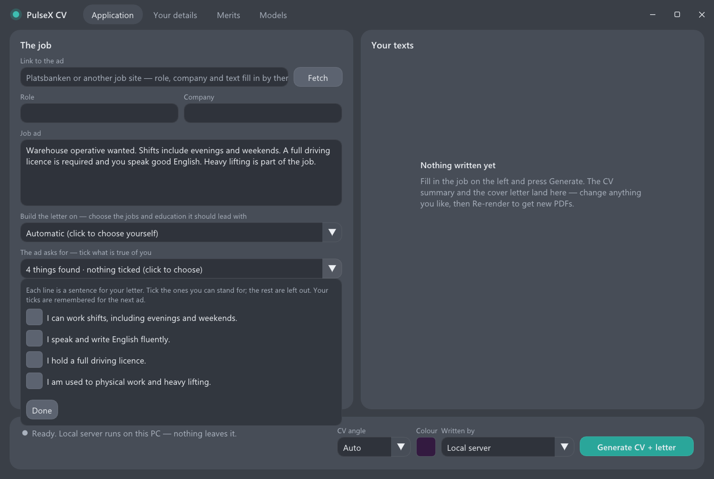
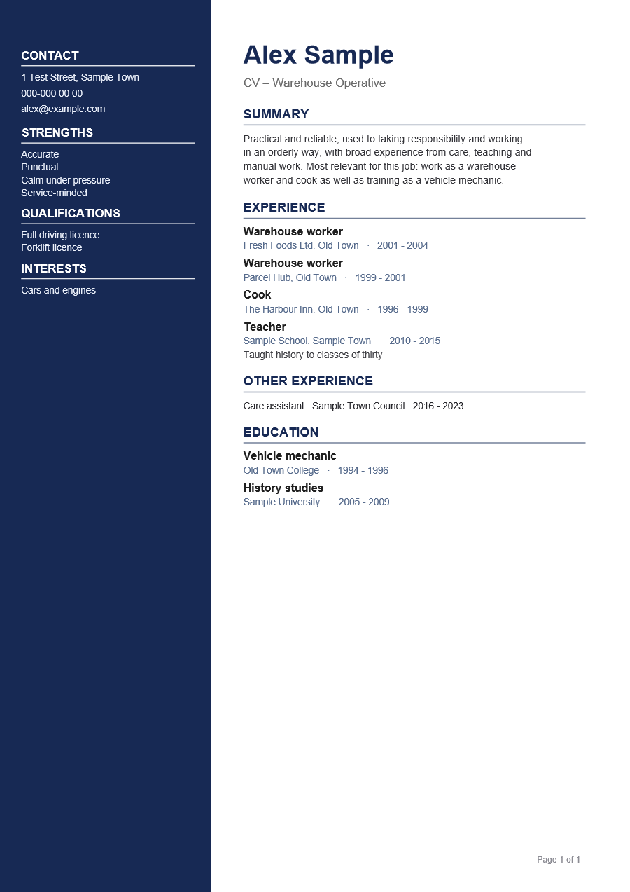

# PulseX CV

A Windows program that writes a CV and a cover letter for one job ad at a time, from your own details and
documents, with a language model of your choice: a model file on your own PC (also on the Snapdragon NPU), Claude
Code, or any cloud model you have a key for. The result is two PDFs in your Downloads folder.

It is built around one rule: **the letter may only say what you have said yourself.** A small local model is not
asked to write a letter. It fills in blanks, and the program writes the sentences around them and checks every one
against your details.

| The window | The CV |
|---|---|
|  |  |

(The persons in the pictures are invented.)

## What it does

- **Reads the ad from a link** (Platsbanken, or any job site that marks up its ads as `JobPosting`), or you paste it.
- **"Build the letter on"** — you tick the jobs and education this letter should lead with. Only those reach the
  model. The first three get a paragraph each; the rest are named in one sentence. The CV is ordered the same way:
  the chosen jobs first and in full, the others as one line each.
- **"The ad asks for"** — the practical things an ad asks for (hours, languages, licences, physical work,
  "experience of ...") are read from its own words and shown as sentences. You tick the ones that are true of you;
  only those are written. The program never turns the ad's wishes into claims about you.
- **A common denominator, not a list.** For each chosen job the program looks for something the ad asks for that
  your own facts also show, and says it in one sentence ("What it shares with the job you offer is handling goods.").
  Nothing found, no sentence.
- **Checks before you send.** Names and years that are not in your details, a chosen job the letter does not
  mention, canned phrases, and spelling in your details are reported in the window.
- **Swedish and English.** The language of the ad decides the language of the letter and of the headings on the CV.

## What you need

- Windows 11 on ARM64 (the binaries in `bin/` are built for Snapdragon X). The program itself is plain Win32 and
  Direct3D 11; building it for x64 is untested.
- A model. One of:
  - **A model file on this PC** — any GGUF and a `llama-server.exe`. The Swedish model used for the examples is
    ready-made: [Pexqman/Llama-3-8B-instruct-AI-Sweden-Q4_0-GGUF](https://huggingface.co/Pexqman/Llama-3-8B-instruct-AI-Sweden-Q4_0-GGUF)
    (4.3 GiB). On the processor any ARM64 build of llama.cpp will do. On the NPU you need the `llama-server.exe` of
    the PulseX fork, which is in `bin/` of [pulsex-zimage](https://github.com/Erik-matrix/pulsex-zimage) (see the
    note there about the self-signed DSP module).
  - **Claude Code** — if `claude` is installed and logged in, it is used through `claude -p`.
  - **A cloud model** — OpenAI-compatible, Anthropic or Google Gemini, with your own key. The key is stored
    encrypted for your Windows account (DPAPI).
  - The built-in "local" engine runs a Qwen3-4B bundle through Qualcomm's Genie runtime. The bundle is not in this
    repository; the window shows it as *not installed* and you choose one of the engines above.

## Start

You can look around first: nothing has to be filled in to open the program. The line at the top of the first page
says what is still missing — your details, your merits, a model — with a button to each.

1. Take the zip of the [latest release](https://github.com/Erik-matrix/pulsex-cv/releases/latest), or clone the
   repository. Run `bin\pulse_cv_gui.exe`.
2. **Your details** — name, contact, jobs and education, one per line:
   `years | title | employer, town | what the job involved`. The fourth field is optional and worth filling in: it is
   what the letter can say about the job, and it is printed under the job on the CV when you choose it.
3. **Merits** — add documents about you (text, Word or PDF; PDF needs `pdftotext` on the PATH). A local model gets
   the passages about the jobs you chose; a cloud model gets everything.
4. **Models** — add your model and press *Test*. A model you add on this PC is chosen by itself; a cloud model you
   choose under *Written by*, because it receives your merits.
5. **Application** — paste the link to the ad, press *Fetch*, tick what to build on and what the ad asks for,
   press *Generate*. Edit the texts on the right if you like and press *Re-render*.

Your details live in `Documents\pulse_cv\` (`cv_data.json`, `vault\`, `engines.json`, `settings.json`); the drafts of
the last run are in `work\` next to the program. With a model on the PC nothing you enter leaves it; a cloud model,
when you pick one, receives your merits and the ad.

`examples/` has an invented person (`cv_data.example.json`) and a model list (`engines.example.json`) to copy from.

## How a small model is kept honest

An 8B model asked for a whole letter writes about whatever it has most text on: every job you ever had, and the ad's
duties as if they were yours. So with a model file on the PC the letter is written one paragraph at a time:

1. The model sums up the job in one sentence. That sentence, not the ad, is what it sees from then on.
2. What the job demands is **read** from the ad against a list (`lang/*.json`, `demands`), not asked. Asked, the
   model names the top of any list whatever the job.
3. For each chosen job the model writes one or two sentences from your facts only, without the job applied for in
   front of it. A sentence stays only if its words are in your facts, its names and years are yours, and it still
   uses your own title. Otherwise the program writes a plain sentence itself.
4. The joints — the link to the job, the remaining choices, what the ad asks for, your traits — are written by the
   program from your own words.

With the example model on a Snapdragon X Plus NPU a letter takes about a minute.

## The language files

Everything the program knows about a language is in `lang/sv.json` and `lang/en.json`:

| Part | What it is for |
|---|---|
| `demands`, `joints` | prioritising: what work demands, the words by which an ad or your facts show it, and the sentences that say it |
| `asks`, `experience` | suggestions: what an ad asks for, as sentences to tick |
| `sentences` | what the program writes itself |
| `prompts` | the questions to a model file on the PC |
| `labels` | headings on the CV and the letter |
| `spelling` | word endings and filler words, and which of Windows' dictionaries to ask |

To add a language, copy a file to `xx.json` and translate it. The language of the ad picks the file.

**Spelling** is checked with Windows' own spell checker, so it works for the languages whose *Basic typing* feature
is installed (Settings › Time & language › Language & region › the language › Language options).

**English with a Swedish model:** the example model answers in Swedish even when asked in English. Its sentences
then fail the checks and the program writes its own, so an English letter is correct but plain. Use an
English-speaking model for English ads.

## Build

The binaries in `bin/` are built from this tree. To build them yourself you need the Windows SDK, LLVM's `clang-cl`,
CMake and Ninja for ARM64, and Qualcomm's QAIRT SDK for the Genie headers (only headers are used; nothing is linked):

```
cmake -S . -B build -G Ninja -DCMAKE_BUILD_TYPE=Release -DCMAKE_C_COMPILER=clang-cl -DCMAKE_CXX_COMPILER=clang-cl -DQNN_SDK=<path to qairt\x.y.z>
ninja -C build
```

## License

The PulseX code in this repository is released under the [MIT License](LICENSE). Dear ImGui and nlohmann/json are
included under their own MIT licenses (see [THIRD_PARTY_NOTICES.md](THIRD_PARTY_NOTICES.md)). No model is included;
each keeps its own license.

This tool drafts CVs and cover letters. You review them and are responsible for what you send.
